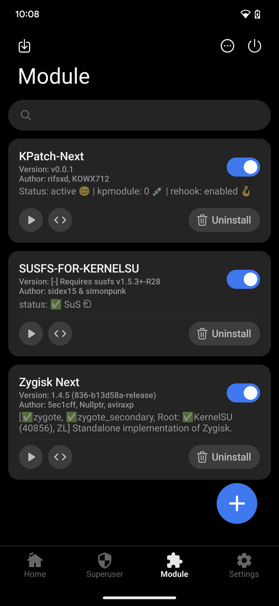

<div align="center">

# 🔥 Wild Kernels for Android

[](https://kernelsu.org/)
[](https://gitlab.com/simonpunk/susfs4ksu)

</div>

## 🌐 Language

- English: [README.md](README.md)
- 繁體中文: [README_zh-TW.md](README_zh-TW.md)

## ⚠️ Your warranty is no longer valid!

I am **not responsible** for bricked devices, damaged hardware, or any issues that arise from using this kernel.

**Please** do thorough research and fully understand the features included in this kernel before flashing it!

By flashing this kernel, **YOU** are choosing to make these modifications. If something goes wrong, **do not blame me**!

---

### 🚨 Proceed at your own risk!

---

## 🔧 Available Kernels

| Kernel | Repository | Status |
|--------|------------|--------|
| 🏗️ **GKI** | [GKI_KernelSU_SUSFS](https://github.com/WildKernels/GKI_KernelSU_SUSFS) | ✅ Active |
| 👑 **Sultan** | [Sultan_KernelSU_SUSFS](https://github.com/WildKernels/Sultan_KernelSU_SUSFS) | ✅ Active |
| 📱 **OnePlus** | [OnePlus_KernelSU_SUSFS](https://github.com/WildKernels/OnePlus_KernelSU_SUSFS) | ✅ Active |

---

## 🔗 Additional Resources

- 🩹 [Kernel Patches](https://github.com/WildKernels/kernel_patches)
- 📜 [Old Build Scripts](https://github.com/TheWildJames/kernel_build_scripts)
- ⚡ [Kernel Flasher](https://github.com/fatalcoder524/KernelFlasher)

---

## 📋 Installation Instructions

For GKI installation, please follow the official guide:

📖 **[KernelSU Installation Guide](https://kernelsu.org/guide/installation.html)**

### Recommended Modules (KPM + SUSFS)

Install these three modules in SukiSU/KernelSU manager:

- [Zygisk Next](https://github.com/Dr-TSNG/ZygiskNext)
- [KPatch-Next Module](https://github.com/KernelSU-Next/KPatch-Next-Module)
- [SUSFS-FOR-KERNELSU](https://github.com/sidex15/susfs4ksu-module)

### Recommended Root Manager

Use **SukiSU Ultra Manager v4.1.3**. The kernel driver is pinned to SukiSU **builtin** commit `6c13a06` — do not track SukiSU `main` / tag tips (they drop kernel-side susfs and break the manager ABI).

### Verified Working State (KPM + SUSFS)



---

## 🧭 OS Patch Level Mapping (Important)

The `date` field in each build matrix config (for example, `.github/config/android13-5.10.json`) is not only a label.
It is passed into the kernel source fetch step as `os_patch_level` and used to select the upstream branch:

- `common-android13-5.10-2023-09`
- `common-android13-5.10-2025-07`

This is why you can see multiple builds with the same sublevel (such as `5.10.107`) but different dates.
Each date points to a different monthly kernel branch.

### Why this matters

If your device firmware/vendor stack is from one patch level, flashing a kernel built from a much newer or older patch level can cause boot failure.

### Practical guidance

- Match build date to your ROM patch level first.
- For Pixel 6 Pro on Android 13 `raven-tq3a.230901.001`, start with `android13-5.10` + `2023-09`.
- Test normal build first, then try bypass only after a known-good boot.

### Pixel 6 Pro (`raven`) fixed examples

If your phone fingerprint is `google/raven/raven:13/TQ3A.230901.001/...`, use `android13-5.10` with `2023-09`.

### Use ADB to determine `kernel_build_version` and `os_patch_level_filter`

Check device values first:

```bash
adb shell getprop ro.build.version.release
adb shell uname -r
adb shell getprop ro.build.version.security_patch
```

Mapping rules:

- `kernel_build_version`
	- Android version comes from `ro.build.version.release`.
	- Kernel major/minor comes from the `uname -r` prefix, for example `5.10.186-android13-...` => `5.10`.
	- Example: Android 13 + kernel 5.10 => `android13-5.10`.
- `os_patch_level_filter`
	- Use year-month from `ro.build.version.security_patch`, for example `2023-09`.

Quick one-liner:

```bash
adb shell 'echo "android=$(getprop ro.build.version.release) kernel=$(uname -r) patch=$(getprop ro.build.version.security_patch)"'
```

SukiSU Ultra + SUSFS + KPM (default):

```yaml
release_type: Action
kernel_build_version: android13-5.10
os_patch_level_filter: "2023-09"
feature_set: KSUN+SUSFS
runner_label: "gki-local"
quick_mode: "true"
use_kpm: "true"
```

How to read the SukiSU app result:

- The SukiSU Ultra v4.1.3 app should detect built-in mode **and** KPM.
- The workflow always uses SukiSU builtin `6c13a06` — there is no branch override input.

### Valid values for `os_patch_level_filter` (Action input)

Use one of the dates below in the Action input `os_patch_level_filter`.
If left empty, the workflow builds all dates for the selected kernel version.

- [android12-5.10.json](.github/config/android12-5.10.json): `2021-08, 2021-09, 2021-10, 2021-11, 2021-12, 2022-01, 2022-02, 2022-03, 2022-04, 2022-05, 2022-06, 2022-07, 2022-08, 2022-09, 2022-10, 2022-11, 2022-12, 2023-01, 2023-02, 2023-03, 2023-04, 2023-05, 2023-06, 2023-07, 2023-09, 2023-11, 2024-01, 2024-03, 2024-05, 2024-08, 2024-11, 2025-02, 2025-05, 2025-06, 2025-09, 2025-12, 2026-04, lts`

- [android13-5.10.json](.github/config/android13-5.10.json): `2022-04, 2022-05, 2022-06, 2022-07, 2022-08, 2022-09, 2022-10, 2022-11, 2022-12, 2023-01, 2023-02, 2023-03, 2023-04, 2023-05, 2023-06, 2023-07, 2023-08, 2023-09, 2023-10, 2023-11, 2023-12, 2024-01, 2024-02, 2024-03, 2024-04, 2024-05, 2024-06, 2024-07, 2024-08, 2024-09, 2024-11, 2025-01, 2025-03, 2025-05, 2025-07, 2025-10, 2026-01, 2026-04, lts`

- [android13-5.15.json](.github/config/android13-5.15.json): `2022-06, 2022-07, 2022-08, 2022-09, 2022-10, 2022-11, 2022-12, 2023-01, 2023-02, 2023-03, 2023-04, 2023-05, 2023-06, 2023-07, 2023-08, 2023-09, 2023-10, 2023-11, 2023-12, 2024-01, 2024-02, 2024-03, 2024-04, 2024-05, 2024-06, 2024-07, 2024-08, 2024-09, 2024-11, 2025-01, 2025-03, 2025-05, 2025-07, 2025-09, 2025-12, 2026-03, 2026-06, lts`

- [android14-5.15.json](.github/config/android14-5.15.json): `2023-06, 2023-08, 2023-09, 2023-11, 2024-01, 2024-02, 2024-03, 2024-04, 2024-05, 2024-06, 2024-07, 2024-08, 2024-09, 2024-11, 2025-01, 2025-03, 2025-05, 2025-07, 2025-10, 2026-01, 2026-04, lts`

- [android14-6.1.json](.github/config/android14-6.1.json): `2023-06, 2023-07, 2023-08, 2023-09, 2023-10, 2023-11, 2023-12, 2024-01, 2024-02, 2024-03, 2024-04, 2024-05, 2024-06, 2024-07, 2024-08, 2024-09, 2024-10, 2024-11, 2024-12, 2025-01, 2025-02, 2025-03, 2025-04, 2025-05, 2025-06, 2025-07, 2025-08, 2025-09, 2025-12, 2026-03, 2026-06, lts`

- [android15-6.6.json](.github/config/android15-6.6.json): `2024-07, 2024-08, 2024-09, 2024-10, 2024-11, 2024-12, 2025-01, 2025-02, 2025-03, 2025-04, 2025-05, 2025-06, 2025-07, 2025-08, 2025-09, 2025-10, 2026-01, 2026-04, 2026-07, lts`

- [android16-6.12.json](.github/config/android16-6.12.json): `2025-06, 2025-07, 2025-08, 2025-09, 2025-12, 2026-03, 2026-06, lts`

- [android17-6.18.json](.github/config/android17-6.18.json): `lts`

### Build artifacts: `Flashable-Zips` vs `AnyKernel3`

After a successful workflow run, you will usually see two artifact groups with the same kernel prefix:

- `...-AnyKernel3`
- `...-Flashable-Zips`

What each one means:

- `AnyKernel3`
	- Raw AnyKernel3 working directory contents.
	- Intended for advanced users who want to inspect or modify packaging files before flashing.
	- May include both `Image` and `Bypass-Image` files depending on build steps.

- `Flashable-Zips`
	- Pre-packed, ready-to-flash zip outputs.
	- Contains two final packages:
		- `...-AnyKernel3-normal.zip` (standard kernel image)
		- `...-AnyKernel3-bypass.zip` (bypass kernel image)
	- Recommended for normal usage when you just want to download and flash.

Quick recommendation:

- Start with `...-AnyKernel3-normal.zip` first.
- Only move to bypass zip if normal boot fails due to version checks or compatibility restrictions.

### Important note for SukiSU mode

If you change the workflow to enable or adjust SukiSU integration, previously built kernel zip files do not gain those features automatically.

- You must rebuild the kernel after changing SukiSU workflow logic.
- You must re-download the newly generated artifact.
- You must re-flash the newly generated zip.

Current `KSUN+SUSFS` behavior:

- Uses SukiSU Ultra **builtin** `6c13a06` with manager tag **v4.1.3** (fixed — no workflow branch input).
- Enables `CONFIG_KPM=y` and runs [`patch_linux`](https://github.com/SukiSU-Ultra/SukiSU_KernelPatch_patch) from the newest GitHub release (default `kpm_patch_ver=latest`, currently `0.13.0`) plus matching `kpimg`.
- Offline fallback: `$HOME/Projects/PxGKI/KernelPatch_patch/patch_linux`. To force a local build, set `kpm_patch_linux_path`.
- Pins susfs4ksu to `ee023e3` (SUSFS v2.1.0) when that commit exists on the gki branch. No KernelSU-Next coexistence patches are applied.

Old zip files built before the SukiSU integration change will still behave like the old build and may boot successfully while the SukiSU app still reports that root is unavailable.

### GitHub Actions `feature_set` options

In the `Build Kernels` workflow, `feature_set` controls optional patch groups.

Token meaning:

- `KSUN`: Enable pinned SukiSU Ultra setup (builtin `6c13a06`)
- `SUSFS`: Enable SUSFS setup/patches
- `BBG`: Enable Baseband Guard patches
- `NET`: Enable networking patch set
- `DS`: Enable DroidSpaces-OSS patches

What BBG / NET / DS actually do:

- `BBG` (Baseband Guard)
	- Installs and enables the Baseband Guard security module (`CONFIG_BBG=y`).
	- Adds `baseband_guard` to the active LSM chain in kernel security config.
	- Intended for security hardening, not for performance tuning.

- `NET` (Networking patch set)
	- Enables extended networking features such as ipset/netfilter options, WireGuard, CIFS, and advanced qdisc settings.
	- Applies BBRv3-related patches on supported versions.
	- Intended for networking capability/performance use cases.

- `DS` (DroidSpaces-OSS)
	- Applies DroidSpaces-OSS compatibility patches.
	- Enables namespace/IPC-related configs (for example PID/IPC/USER namespaces and SYSVIPC-related options).
	- Intended for DroidSpaces-style isolation/container workflows.

Recommended usage order (stability-first):

- Start with `KSUN+SUSFS` only.
- Add `BBG`/`NET`/`DS` one by one after confirming boot stability.

Available options in the action menu:

- `KSUN+SUSFS+BBG+NET+DS`: Enable all five optional groups
- `KSUN+SUSFS+BBG`: Enable KernelSU + SUSFS + Baseband Guard
- `KSUN+SUSFS+NET`: Enable KernelSU + SUSFS + networking
- `KSUN+SUSFS+DS`: Enable KernelSU + SUSFS + DroidSpaces
- `KSUN+SUSFS`: Enable KernelSU + SUSFS
- `KSUN+BBG`: Enable KernelSU + Baseband Guard
- `KSUN+NET`: Enable KernelSU + networking
- `KSUN+DS`: Enable KernelSU + DroidSpaces
- `KSUN`: Enable KernelSU only
- `NONE`: Disable all five optional groups above
- `FULL`: Alias for enabling all optional groups (same effective behavior as `KSUN+SUSFS+BBG+NET+DS`)

Notes:

- `feature_set` does not control all steps in the pipeline.
- Core compatibility/build steps still run (for example: kernel fixes, ntsync, ptrace, unicode fix, btf, packaging).

### GitHub Actions `quick_mode` (faster single build)

`quick_mode` is a workflow input in `Build Kernels` to reduce turnaround time when you only need a quick validation build.

When `quick_mode=true`:

- Skip free-disk cleanup step.
- Skip swap setup step.
- Skip bypass kernel compilation (builds normal kernel only).
- `Flashable-Zips` artifact includes only `...-AnyKernel3-normal.zip`.

When `quick_mode=false` (default):

- Runs the full flow, including normal + bypass build and both flashable zips.

Recommended usage:

- Use `quick_mode=true` for smoke tests and iteration.
- Switch back to `quick_mode=false` for final release builds.

### GitHub Actions `runner_label` (self-hosted support)

`runner_label` lets you choose where the kernel build job runs:

- `ubuntu-latest`: GitHub-hosted runner (default)
- `self-hosted`: your own machine/runner
- `gki-local`: example custom label for a dedicated local kernel builder

Why use self-hosted:

- You can keep source trees and caches across runs.
- You can fully use your local CPU resources (for example, 12C/24T).
- Rebuild/iteration is usually much faster after the first run.

Note:

- In this workflow, disk cleanup and swap setup steps are only applied when `runner_label=ubuntu-latest`.
- This repository now defaults `runner_label` to `gki-local` for convenience if you already registered that label on your self-hosted runner.

### Complete input example (fast path)

Below is a full example for `Build Kernels` workflow inputs focused on a single, fast run:

```yaml
release_type: Action
kernel_build_version: android13-5.10
os_patch_level_filter: "2023-09"
feature_set: KSUN+SUSFS
runner_label: "gki-local"
quick_mode: "true"
use_kpm: "true"
susfs_commit_android12-5-10: ""
susfs_commit_android13-5-10: ""
susfs_commit_android13-5-15: ""
susfs_commit_android14-5-15: ""
susfs_commit_android14-6-1: ""
susfs_commit_android15-6-6: ""
susfs_commit_android16-6-12: ""
```

Notes for this example:

- SukiSU driver is always pinned to builtin `6c13a06` / manager `v4.1.3`.
- Empty `susfs_commit_*` uses `ee023e3` when that commit is on the gki branch, otherwise the branch tip.
- Only `android13-5.10` + `2023-09` is built.

If you already have a self-hosted runner, set:

- `runner_label: "gki-local"` for a dedicated local runner label, or `runner_label: "self-hosted"` if you only use the generic label.

---

## ✨ Features

- 🔐 **SukiSU Ultra**: Kernel-based root via pinned builtin driver (`6c13a06`) with KPM + SUSFS
- 🛡️ **SUSFS**: An addon root hiding kernel patches and userspace module for KernelSU

---

## 🏆 Credits

- 🔐 **KernelSU**: Developed by [tiann](https://github.com/tiann/KernelSU)
- 🚀 **SukiSU Ultra**: [SukiSU-Ultra](https://github.com/SukiSU-Ultra/SukiSU-Ultra) (pinned builtin `6c13a06`)
- ✨ **Magic-KSU**: Developed by [5ec1cff](https://github.com/5ec1cff/KernelSU)
- 🛡️ **SUSFS**: Developed by [simonpunk](https://gitlab.com/simonpunk/susfs4ksu.git)
- 🛡️ **Baseband-guard (BBG)**: Developed by [vc-teahouse](https://github.com/vc-teahouse/Baseband-guard)
- 📦 **SUSFS Module**: Developed by [sidex15](https://github.com/sidex15)
- 👑 **Sultan Kernels**: Developed by [kerneltoast](https://github.com/kerneltoast)
- 🔧 **Device Boot Fix**: [Boot fix commit](https://github.com/Anything-at-25-00/android_kernel_common_android12-5.10/commit/2476d262b597fe8af82cfb7aaf96676f51c6b4ed) for fixing some devices not booting

🙏 Special thanks to the open-source community for their contributions!

---

## 💬 Support

If you encounter any issues or need help, feel free to:
- 🐛 Open an issue in this repository
- 💬 Reach out to me directly

---

## ⚠️ Disclaimer

Flashing this kernel will void your warranty, and there is always a risk of bricking your device. Please make sure to:
- 💾 Back up your data
- 🧠 Understand the risks before proceeding

**🚨 Proceed at your own risk!**

---

<div align="center">

## 📱 Connect With Us

[](https://t.me/TheWildJames)
[](https://t.me/WildKernelsTG)

</div>

---

## 🌟 Special Thanks

**These amazing people help make this project possible! ❤️**

| Contributor | Contribution |
|-------------|-------------|
| 🛡️ [simonpunk](https://gitlab.com/simonpunk/susfs4ksu.git) | Created SUSFS! |
| 📦 [sidex15](https://github.com/sidex15) | Created module! |
| 🩹 [backslashxx](https://github.com/backslashxx) | Helped with patches! |
| 🔧 [Teemo](https://github.com/liqideqq) | Helped with patches! |
| 💝 [幕落](https://github.com/MuLuo688) | Donation! |
| 🛡️ [vc-teahouse](https://github.com/vc-teahouse) | Created Baseband-guard (BBG)! |

*If you have contributed and are not listed here, please remind me!* 🙏

---

## 💝 Donations

Any and all donations are appreciated!

- PayPal: [bauhd@outlook.com](mailto:bauhd@outlook.com)
- Card: <https://buy.stripe.com/5kQ28sdi08Nr0Xc2fU5os00>
- LTC: MVaN1ToSuks2cdK9mB3M8EHCfzQSyEMf6h
- BTC: 3BBXAMS4ZuCZwfbTXxWGczxHF4isymeyxG
- ETH: 0x2b9C846c84d58717e784458406235C09a834274e
- Patreon: <https://patreon.com/WildKernels>
