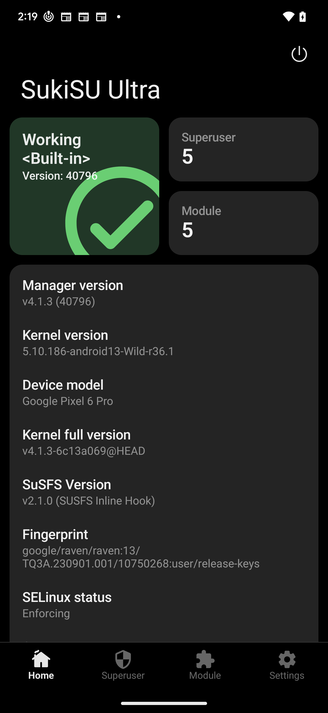
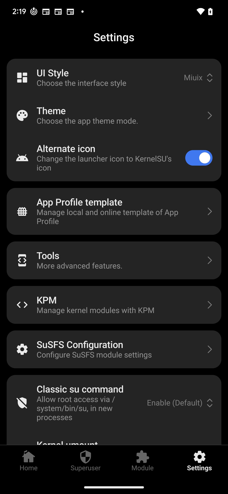
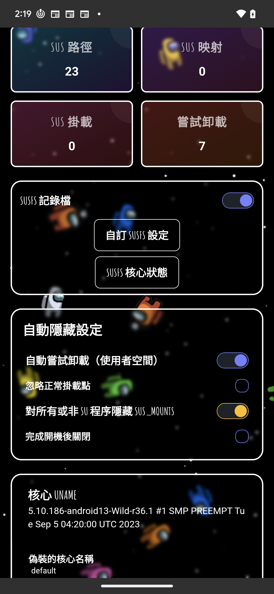

<div align="center">

# 🔥 Wild Kernels for Android（繁體中文說明）

[](https://kernelsu.org/)
[](https://github.com/SukiSU-Ultra/SukiSU-Ultra/releases/tag/v4.1.3)
[](https://github.com/SukiSU-Ultra/SukiSU_KernelPatch_patch/releases/tag/0.13.0)
[](https://gitlab.com/simonpunk/susfs4ksu)

</div>

## 🌐 語系

- English: [README.md](README.md)
- 繁體中文: [README_zh-TW.md](README_zh-TW.md)

## ⚠️ 風險聲明

我**不對**刷入此核心後造成的裝置損壞、資料遺失、硬體異常或任何問題負責。

請先充分了解此核心功能與風險，再進行刷機。

一旦刷入，代表你已自行承擔所有後果。

---

### 🚨 請自行承擔風險

---

## 🔧 可用核心專案

| 核心 | 倉庫 | 狀態 |
|--------|------------|--------|
| 🏗️ **GKI** | [GKI_KernelSU_SUSFS](https://github.com/WildKernels/GKI_KernelSU_SUSFS) | ✅ Active |
| 👑 **Sultan** | [Sultan_KernelSU_SUSFS](https://github.com/WildKernels/Sultan_KernelSU_SUSFS) | ✅ Active |
| 📱 **OnePlus** | [OnePlus_KernelSU_SUSFS](https://github.com/WildKernels/OnePlus_KernelSU_SUSFS) | ✅ Active |

---

## 🔗 其他資源

- 🩹 [Kernel Patches](https://github.com/WildKernels/kernel_patches)
- 📜 [Old Build Scripts](https://github.com/TheWildJames/kernel_build_scripts)
- 📲 [Horizon Kernel Flasher](https://github.com/libxzr/HorizonKernelFlasher)（建議：刷 `*-AnyKernel3-normal.zip`）
- ⚡ [Kernel Flasher](https://github.com/fatalcoder524/KernelFlasher)（進階：A/B slot 備份／還原）

---

## 📋 安裝說明

GKI 安裝方式也可參考官方文件：

📖 **[KernelSU 安裝指南](https://kernelsu.org/guide/installation.html)**

### 支援版本（請對齊，不要混用）

| 元件 | 支援版本 | 下載 |
|------|----------|------|
| 🔐 **SukiSU Ultra 管理器** | **v4.1.3**（versionCode `40796`） | [SukiSU-Ultra v4.1.3](https://github.com/SukiSU-Ultra/SukiSU-Ultra/releases/tag/v4.1.3) |
| 🧠 **SukiSU kernel driver** | **builtin** `6c13a06`（與 v4.1.3 同一組 ABI） | 已編進此核心 |
| 🧩 **KPM**（KernelPatch） | **v0.13.0**（`patch_linux` + `kpimg`） | [SukiSU_KernelPatch_patch 0.13.0](https://github.com/SukiSU-Ultra/SukiSU_KernelPatch_patch/releases/tag/0.13.0) |
| 🛡️ **SUSFS** | kernel **v2.1.0** + 使用者空間模組 | [SUSFS-FOR-KERNELSU](https://github.com/sidex15/susfs4ksu-module) |

不要改裝更新的 SukiSU manager，也不要換成別版 KPM：`main` / 較新 tag 沒有 kernel 端 susfs，且 manager ABI 不相容。KPM 工具已放在 repo [`SukiSU_KernelPatch_patch/`](SukiSU_KernelPatch_patch/)，編譯時寫入 `Image`。

### 目前支援（已驗證）

此核心已針對 **SukiSU Ultra v4.1.3** 做相容修正，並同時支援 **KPM v0.13.0** 與 **SUSFS 模組**。

Pixel 6 Pro（`raven` / `TQ3A.230901.001`）刷入後 `uname -r` 範例：`5.10.186-android13-Wild-r36.1`。

### 1. 下載哪一個檔案

workflow 成功後**只會上傳一個**可刷產物，例如：

`5.10.186-android13-2023-09-r36.1-AnyKernel3-normal.zip`

下載後直接丟給 Horizon，不必再解一層包裝。不再產出 `*-bypass` 或沒有 `-normal` 後綴的 `*-AnyKernel3`。

### 2. 用 Horizon 刷 `*-AnyKernel3-normal.zip`

已驗證工具：[Horizon Kernel Flasher v1.3](https://github.com/libxzr/HorizonKernelFlasher/releases/tag/v1.3)

前提：

- bootloader 已解鎖
- 手機**已經有 root**（Horizon 需要 root；可用既有 Magisk / KernelSU / SukiSU LKM）
- 已把 `*-AnyKernel3-normal.zip` 放到手機儲存空間

步驟：

1. 安裝 `HorizonKernelFlasher-v1.3.apk`，在 SukiSU / KernelSU / Magisk 裡允許它 root。
2. 打開 Horizon → 選取 `*-AnyKernel3-normal.zip`（例如 `5.10.186-android13-2023-09-r36.1-AnyKernel3-normal.zip`）。
3. 刷入目前 active slot，完成後重開機。
4. 確認核心版本：

```bash
adb shell uname -a
# 應類似：Linux localhost 5.10.186-android13-Wild-r36.1 #1 SMP PREEMPT ... aarch64 Toybox
```

若你目前是 KSU LKM（原廠 kernel + 模組 root），建議刷 GKI 前先備份目前 `boot`。Pixel 6 / 6 Pro 沒有獨立 `init_boot`，動的是 `boot`。

備援：也可用 [Kernel Flasher](https://github.com/fatalcoder524/KernelFlasher) 對 active slot 刷同一顆 zip（可先 Backup）。

### 建議安裝模組（KPM + SUSFS）

刷完核心、SukiSU 顯示 built-in + KPM 後，在管理器安裝以下三個模組：

- [Zygisk Next](https://github.com/Dr-TSNG/ZygiskNext)
- [KPatch-Next Module](https://github.com/KernelSU-Next/KPatch-Next-Module)
- [SUSFS-FOR-KERNELSU](https://github.com/sidex15/susfs4ksu-module)

### 建議使用的 Root 管理工具

請用 **[SukiSU Ultra Manager v4.1.3](https://github.com/SukiSU-Ultra/SukiSU-Ultra/releases/tag/v4.1.3)**（versionCode `40796`）。核心 driver 固定釘在 SukiSU **builtin** commit `6c13a06`，KPM 為 **v0.13.0**——不要追 SukiSU `main` / 更新的 manager tag，也不要換別版 KPM（那些 ref 沒有 kernel 端 susfs，且 manager ABI 不相容）。

### 驗證成功畫面（Pixel 6 Pro）

Pixel 6 Pro（`raven` / `TQ3A.230901.001`）刷入 `5.10.186-android13-Wild-r36.1` 後：SukiSU Ultra **v4.1.3** 顯示 Working \<Built-in\>、SuSFS v2.1.0；設定頁可見 **KPM** 與 **SuSFS Configuration**；SUSFS WebUI 可讀取核心 uname。

| 首頁（Built-in + SuSFS） | 設定（KPM / SuSFS） | SUSFS WebUI |
|--------------------------|---------------------|-------------|
|  |  |  |

### 疑難排解：WebUI 顯示全 0、按鈕沒反應、自動隱藏為空

若你看到 `SUS 路徑 / SUS 映射 / SUS 掛載 / 嘗試卸載` 全部都是 `0`，通常代表「SUSFS 使用者空間規則沒有載入」或「WebUI 腳本未拿到 root 執行權限」，不一定是 kernel 沒編進去。

先用下面指令確認 kernel 端是否存在 SUSFS：

```bash
adb shell su -c 'zcat /proc/config.gz 2>/dev/null | grep -E "CONFIG_KSU|CONFIG_KSU_SUSFS"'
adb shell su -c 'grep -i susfs /proc/kallsyms | head -n 20'
```

再確認模組端是否完整安裝：

```bash
adb shell su -c 'ls -al /data/adb/modules'
adb shell su -c 'ls -al /data/adb/modules | grep -i susfs'
adb shell su -c 'ls -al /data/adb/susfs 2>/dev/null'
```

如果 kernel 端有 SUSFS 符號、但 WebUI 仍全 0，請依序做：

1. 在 SukiSU/KernelSU 管理器中，確認 WebUI 對應應用有 root 權限（允許且不彈窗）。
2. 重新安裝最新版 `SUSFS-FOR-KERNELSU` 模組（需符合 WebUI 顯示的最低版本要求，例如 `v1.5.3+-r28`）。
3. 同時安裝並啟用 `Zygisk Next` 與 `KPatch-Next Module`，安裝後完整重開機。
4. 進入模組頁面執行一次動作（例如重建/套用規則）再回 WebUI 檢查計數。

補充：`自動隱藏設定` 的內容來自 SUSFS 模組與其規則檔，不是 kernel 內建固定清單。若該區塊是空白，優先排查模組初始化與權限，而不是只重編 kernel。

---

## 🧭 OS Patch Level 對應說明（重要）

各版本設定檔中的 `date`（例如 `.github/config/android13-5.10.json`）**不只是標籤**。

它會在下載核心原始碼時，被當成 `os_patch_level` 使用，並拼成上游分支名稱，例如：

- `common-android13-5.10-2023-09`
- `common-android13-5.10-2025-07`

這也是為什麼你會看到同一個 sublevel（例如 `5.10.107`）但有多個不同日期。
每個日期都代表不同月份的核心分支。

### 為什麼這很重要

若你的裝置 firmware/vendor stack 屬於某個 patch level，卻刷入差距很大的月份核心，可能導致無法開機。

### 實務建議

- 先讓 build 日期對齊你目前 ROM 的 patch level。
- Pixel 6 Pro（Android 13，`raven-tq3a.230901.001`）建議先從 `android13-5.10` + `2023-09` 開始。
- 下載並刷 `*-AnyKernel3-normal.zip`。

### Pixel 6 Pro（`raven`）固定範例

如果你的手機 fingerprint 是 `google/raven/raven:13/TQ3A.230901.001/...`，就用 `android13-5.10` 搭配 `2023-09`。

### 用 ADB 查 `kernel_build_version` 與 `os_patch_level_filter`

先確認手機資訊：

```bash
adb shell getprop ro.build.version.release
adb shell uname -r
adb shell getprop ro.build.version.security_patch
```

對照方式：

- `kernel_build_version`
  - Android 版本看 `ro.build.version.release`。
  - Kernel 主版本看 `uname -r` 開頭，例如 `5.10.186-android13-...` 對應 `5.10`。
  - 例如 Android 13 + Kernel 5.10 => `android13-5.10`。
- `os_patch_level_filter`
  - 直接使用 `ro.build.version.security_patch` 的年月，例如 `2023-09`。

一行快速查看：

```bash
adb shell 'echo "android=$(getprop ro.build.version.release) kernel=$(uname -r) patch=$(getprop ro.build.version.security_patch)"'
```

SukiSU Ultra + SUSFS + KPM（預設）：

```yaml
release_type: Action
kernel_build_version: android13-5.10
os_patch_level_filter: "2023-09"
feature_set: KSUN+SUSFS
runner_label: "gki-local"
quick_mode: "true"
use_kpm: "true"
```

SukiSU app 畫面判讀方式：

- SukiSU Ultra v4.1.3 app 應該會判斷成 built-in 模式，且 KPM 為啟用。
- workflow 固定使用 SukiSU builtin `6c13a06`，沒有 branch 覆寫輸入。

### 編譯產物

每次 workflow 成功後只會上傳一個可刷產物：

- `...-AnyKernel3-normal.zip`

這就是給 [Horizon Kernel Flasher](https://github.com/libxzr/HorizonKernelFlasher) 的 zip。不會再產出 `*-bypass` 或原始 `*-AnyKernel3` 工作目錄。

### GitHub Actions `feature_set` 選項說明

`Build Kernels` workflow 的 `feature_set` 用來控制「可選功能群組」。

代碼含義：

- `KSUN`：啟用釘住的 SukiSU Ultra（builtin `6c13a06`）
- `SUSFS`：啟用 SUSFS patch 流程
- `BBG`：啟用 Baseband Guard
- `NET`：啟用 Networking patch 集
- `DS`：啟用 DroidSpaces-OSS patches

Actions 選單中各選項意義：

- `KSUN+SUSFS+BBG+NET+DS`：啟用上述五個功能群組
- `KSUN+SUSFS+BBG`：啟用 KernelSU + SUSFS + BBG
- `KSUN+SUSFS+NET`：啟用 KernelSU + SUSFS + NET
- `KSUN+SUSFS+DS`：啟用 KernelSU + SUSFS + DS
- `KSUN+SUSFS`：啟用 KernelSU + SUSFS
- `KSUN+BBG`：啟用 KernelSU + BBG
- `KSUN+NET`：啟用 KernelSU + NET
- `KSUN+DS`：啟用 KernelSU + DS
- `KSUN`：只啟用 KernelSU
- `NONE`：停用上述五個可選群組
- `FULL`：等同全開（效果同 `KSUN+SUSFS+BBG+NET+DS`）

注意：

- `feature_set` 不會控制所有 build 步驟。
- 某些核心相容與打包步驟仍會執行（例如：kernel fixes、ntsync、ptrace、unicode fix、btf、封裝流程）。

### SukiSU 補充說明

目前 `KSUN+SUSFS` 的行為：

- 固定走 SukiSU Ultra **builtin** `6c13a06` + manager **v4.1.3**（無 workflow branch 變數）。
- 開啟 `CONFIG_KPM=y`，編譯後使用 repo 內 [`SukiSU_KernelPatch_patch/`](SukiSU_KernelPatch_patch/) 的 `patch_linux` + `kpimg`（v0.13.0）。
- susfs4ksu 在該 gki 分支找得到時釘 `ee023e3`。不再套用 pershoot KernelSU-Next 共存 patch。

### GitHub Actions `quick_mode`（快速編譯）

`Build Kernels` workflow 新增 `quick_mode` 輸入，用於縮短單次驗證 build 的時間。

當 `quick_mode=true`：

- 跳過磁碟清理步驟（Free Disk Space）。
- 跳過 swap 建立步驟（Setup more Swap）。

當 `quick_mode=false`（預設）：

- 走完整流程（仍只編譯並上傳 `...-AnyKernel3-normal.zip`，不含 bypass）。

建議使用方式：

- 平常驗證或除錯先用 `quick_mode=true`。
- 正式發版再改回 `quick_mode=false`。

### GitHub Actions `runner_label`（支援 self-hosted）

`runner_label` 可指定核心編譯 job 要跑在哪種 runner：

- `ubuntu-latest`：GitHub 公用 runner（預設）
- `self-hosted`：你自己的主機 runner
- `gki-local`：範例自訂標籤，適合專門拿來編 kernel 的本機 runner

為什麼建議 self-hosted：

- 可保留 source tree 與快取，不用每次從零開始。
- 可完整使用本機 CPU 資源（例如 12C/24T）。
- 第一次後的重編譯通常會快很多。

注意：

- 目前 workflow 只有在 `runner_label=ubuntu-latest` 時，才會執行磁碟清理與 swap 建立步驟。
- 這個 repo 目前已把 `runner_label` 預設值設為 `gki-local`，方便你已經配置好本機 runner 時直接使用。

### 完整輸入範例（快速路徑）

以下是 `Build Kernels` workflow 的完整輸入範例，適合單一版本快速驗證：

```yaml
release_type: Action
kernel_build_version: android13-5.10
os_patch_level_filter: "2023-09"
feature_set: KSUN+SUSFS
runner_label: "gki-local"
quick_mode: "true"
use_kpm: "true"
susfs_commit_android12-5-10: ""
susfs_commit_android13-5-10: ""
susfs_commit_android13-5-15: ""
susfs_commit_android14-5-15: ""
susfs_commit_android14-6-1: ""
susfs_commit_android15-6-6: ""
susfs_commit_android16-6-12: ""
```

此範例補充：

- SukiSU driver 固定為 builtin `6c13a06` / manager `v4.1.3`。
- `susfs_commit_*` 留空時，該 gki 分支若有 `ee023e3` 就用它，否則用分支 tip。
- 只會編譯 `android13-5.10` + `2023-09` 這一組。

若你已經配置好 self-hosted runner，可改成：

- `runner_label: "gki-local"` 代表用你專門配置的本機標籤，若你只有通用標籤則可填 `runner_label: "self-hosted"`。

---

## ✨ 主要功能

- 🔐 **SukiSU Ultra**：已做相容修正，請用 Manager **[v4.1.3](https://github.com/SukiSU-Ultra/SukiSU-Ultra/releases/tag/v4.1.3)** + builtin driver `6c13a06`（built-in 模式）
- 🧩 **KPM**：**v0.13.0**（`CONFIG_KPM=y`，Image 內嵌 `patch_linux` + `kpimg`）
- 🛡️ **SUSFS**：kernel 端補丁 + [SUSFS-FOR-KERNELSU](https://github.com/sidex15/susfs4ksu-module) 使用者空間模組

---

## 🏆 鳴謝

- 🔐 **KernelSU**：由 [tiann](https://github.com/tiann/KernelSU) 開發
- 🚀 **SukiSU Ultra**：[SukiSU-Ultra](https://github.com/SukiSU-Ultra/SukiSU-Ultra)（釘住 builtin `6c13a06`）
- ✨ **Magic-KSU**：由 [5ec1cff](https://github.com/5ec1cff/KernelSU) 開發
- 🛡️ **SUSFS**：由 [simonpunk](https://gitlab.com/simonpunk/susfs4ksu.git) 開發
- 🛡️ **Baseband-guard (BBG)**：由 [vc-teahouse](https://github.com/vc-teahouse/Baseband-guard) 開發
- 📦 **SUSFS Module**：由 [sidex15](https://github.com/sidex15) 開發
- 👑 **Sultan Kernels**：由 [kerneltoast](https://github.com/kerneltoast) 開發
- 🔧 **Device Boot Fix**：參考 [Boot fix commit](https://github.com/Anything-at-25-00/android_kernel_common_android12-5.10/commit/2476d262b597fe8af82cfb7aaf96676f51c6b4ed)

感謝所有開源貢獻者。

---

## 💬 支援

如遇問題，歡迎：

- 🐛 在此倉庫開 issue
- 💬 直接聯絡維護者

---

## ⚠️ 免責聲明

刷入此核心可能使保固失效，且存在變磚風險。請務必：

- 💾 先備份資料
- 🧠 充分理解風險

**🚨 請自行承擔風險**

---

<div align="center">

## 📱 聯絡我們

[](https://t.me/TheWildJames)
[](https://t.me/WildKernelsTG)

</div>

---

## 🌟 特別感謝

**以下夥伴讓此專案成為可能 ❤️**

| 貢獻者 | 貢獻 |
|-------------|-------------|
| 🛡️ [simonpunk](https://gitlab.com/simonpunk/susfs4ksu.git) | 建立 SUSFS |
| 📦 [sidex15](https://github.com/sidex15) | 製作模組 |
| 🩹 [backslashxx](https://github.com/backslashxx) | 協助 patches |
| 🔧 [Teemo](https://github.com/liqideqq) | 協助 patches |
| 💝 [幕落](https://github.com/MuLuo688) | 捐助 |
| 🛡️ [vc-teahouse](https://github.com/vc-teahouse) | 建立 BBG |

若你有貢獻但尚未列名，請提醒維護者。

---

## 💝 捐助

任何形式的支持都非常感謝：

- PayPal: [bauhd@outlook.com](mailto:bauhd@outlook.com)
- Card: <https://buy.stripe.com/5kQ28sdi08Nr0Xc2fU5os00>
- LTC: MVaN1ToSuks2cdK9mB3M8EHCfzQSyEMf6h
- BTC: 3BBXAMS4ZuCZwfbTXxWGczxHF4isymeyxG
- ETH: 0x2b9C846c84d58717e784458406235C09a834274e
- Patreon: <https://patreon.com/WildKernels>
